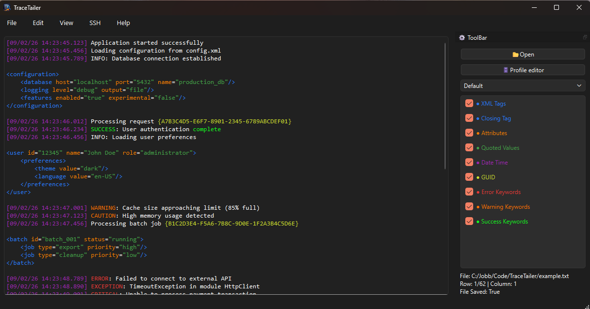

# TraceTailer


A powerful desktop application for viewing trace/log files with customizable syntax highlighting.



## Features

- 📁 **Open and view** large log and trace files
- 🎨 **Customizable syntax highlighting** with regex patterns
- 👤 **Multiple profiles** - create and switch between different highlighting configurations
- 🎯 **Pattern matching** for XML tags, timestamps, GUIDs, error messages, and more
- 💾 **Profile management** - save, edit, and share your highlighting profiles

## Example profile structure

```json
{
  "My Profile": [
    {
      "name": "Error Keywords",
      "expression": "(?i)\\b(?:error|exception|fail|fatal|critical)\\b",
      "color": "#E53935",
      "bold": true,
      "enabled": true
    },
    {
      "name": "Timestamps",
      "expression": "\\d{4}-\\d{2}-\\d{2} \\d{2}:\\d{2}:\\d{2}",
      "color": "#9C27B0",
      "enabled": true
    }
  ]
}
```

## Acknowledgments

- Built with **PyQt6**
- [PyQt6 (riverbankcomputing)](https://www.riverbankcomputing.com/software/pyqt/)
- [pypi.org](https://pypi.org/project/PyQt6/)
- Inspired by classic Unix `tail` command
---

**Note:** This is an early version.

## Future features

- 🔍 **Search functionality** with regex support
- 🔄 **Real-time tail mode** - follow files as they update (like `tail -f`)
- 📄 **Multiple files opened simultaneously**
